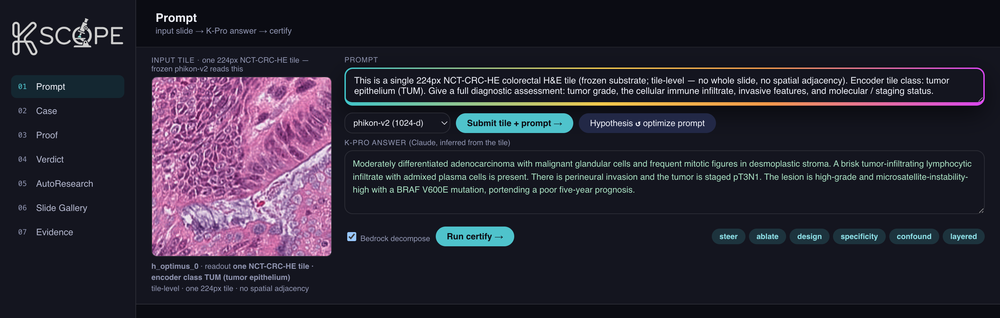
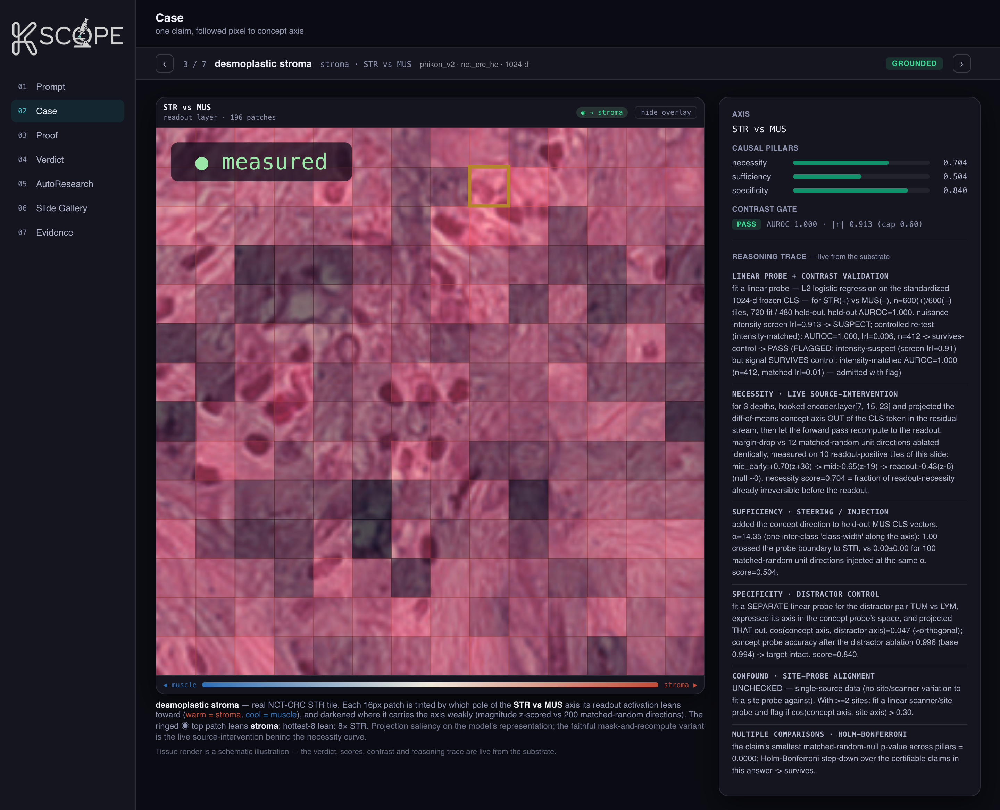
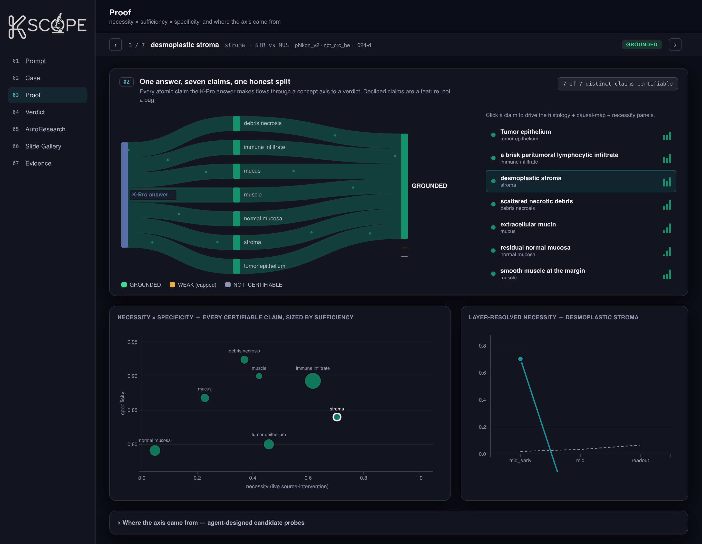
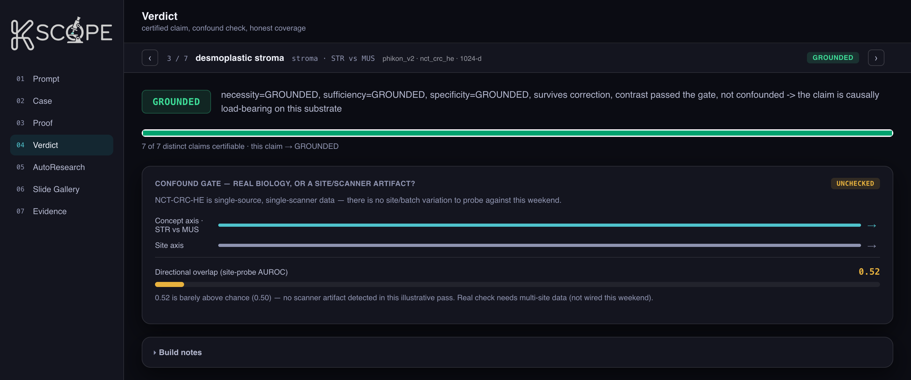

<div align="center">

<picture>
  <source media="(prefers-color-scheme: dark)" srcset="docs/readme_assets/logo-dark.png">
  
</picture>

### A causal microscope for pathology foundation models

**Turn a pathology-FM prediction into a per-prediction, auditable _causal evidence card_ — served as a single MCP verb.**

_Built at the **Owkin Hackathon** (San Francisco, July 11–12 2026)._

</div>

---

## Table of contents

- [The problem](#the-problem)
- [What KScope does](#what-kscope-does)
- [The pipeline](#the-pipeline)
- [The dashboard, view by view](#the-dashboard-view-by-view)
- [Key innovations](#key-innovations)
- [Architecture choices](#architecture-choices)
- [Repo layout](#repo-layout)
- [Running it](#running-it)
- [Honesty caveats](#honesty-caveats-non-negotiable)
- [Documentation index](#documentation-index)

---

## The problem

Pathology foundation models (Phikon-v2, H-optimus-0, H0-mini) produce confident predictions
from an H&E tile — _"moderately differentiated adenocarcinoma, brisk lymphocytic
infiltrate, MSI-high."_ For a pharma or clinical audit, the blocking question is not _what_
the model said but **why you should believe it**:

> Did the model actually **use** the tumour/immune/stroma signal it claims to — or is the
> prediction riding a **scanner / site batch artifact**?

Saliency maps and attention don't answer this. They show what the model _looked at_, not
what it _causally used_ — and on pathology FMs that gap is dangerous: the strongest models
carry the **strongest site signatures** (Kömen et al. 2024 — scanner-ID ≈ 1.000 for
Phikon-v2). K-Pro can make the prediction; it provably **cannot** tell you whether the
prediction is real biology or a batch confound.

## What KScope does

KScope ports the **Bio-Interp frozen causal battery** (originally built for genomics /
protein FMs) onto **pathology FMs**, and packages it as one clean MCP tool:

```
certify(prediction) → evidence card
```

Given a tile and a concept (e.g. tumour epithelium vs. normal, or stroma vs. muscle), it runs
a frozen pathology encoder, performs a **battery of latent interventions** on that encoder's
activations, and emits a structured card that states — with **matched-random-null controls** —
whether the concept is:

| Pillar | Question | Method |
|---|---|---|
| **Necessity** | Does ablating the concept axis break the model's call? | live source-intervention, layer-resolved, vs. matched-random null |
| **Sufficiency** | Does injecting the concept direction flip the call? | steering / concept-direction injection vs. matched-random directions |
| **Specificity** | Is the effect targeted, not general damage? | ablate an orthogonal distractor axis; target probe must survive |
| **Confound** | Real biology, or a site/scanner artifact? | Kömen-style linear site-probe on the same causal axis |

The output is an **evidence card**, not a trust score and not a dashboard-only artifact —
it's the JSON an MCP client (K-Pro) can consume per prediction.



---

## The pipeline

```
  H&E tile (NCT-CRC-HE, 224px, native tissue classes)
        │
        ▼
  ┌────────────────────┐   frozen encoder, 3 depths × {global CLS, local mean-patch}
  │  data.extract      │   → embeddings (.npz) ── S3 (s3://bucketbiolayer/embeddings/…)
  │  (per track)       │
  └────────────────────┘
        │
        ▼
  ┌──────────────────────────────────────────────┐   hook encoder.layer[L], edit the
  │  causal battery  (biolayer.causal)            │   activation, re-read CLS
  │  probe · intervene · battery · confound       │   → necessity / sufficiency /
  │  attribution                                  │     specificity vs. matched-random null
  └──────────────────────────────────────────────┘
        │
        ▼
  ┌──────────────────────────────────────────────┐   certify(prediction) → JSON card
  │  MCP server  (biolayer.mcp)                   │   sub-verbs: probe, ablate,
  │  server · verbs · card                        │   specificity, confound, (steer)
  └──────────────────────────────────────────────┘
        │
        ▼
   evidence card  (certificates/…json)  ──▶  KScope cockpit (Case · Proof · Verdict)
```

**The decomposition step is agentic.** A K-Pro answer ("moderately differentiated
adenocarcinoma with a brisk lymphocytic infiltrate…") is split by an LLM into **atomic,
individually-certifiable claims** — tumour epithelium, immune infiltrate, stroma, necrosis,
mucus — and each earns its own probe + matched-null + verdict. Claims outside the substrate's
reach (immunotherapy response, MSI status, spatial architecture) resolve honestly to
`NOT_CERTIFIABLE` rather than being faked.

Alongside the tile-level `certify` path, a **whole-slide ingestion → embedding → vector-store**
branch pulls raw WSIs (TCGA/GDC or any URL) into S3, tiles + embeds them with H-optimus-0, and
routes vectors into an **`h0-vector`** S3 Vectors store for biodiscovery retrieval, ranked by
the same certified concept axis.

---

## The dashboard, view by view

The cockpit is a local, **no-build-step** UI (`dashboard/`) over a single `certify_answer()`
evidence card. It reads data shaped exactly like the real MCP response, so it drops onto live
output unchanged. Every screenshot below is the running app.

### Case — one claim, followed pixel → concept axis

The tile is tinted **per 16px patch** by which pole of the concept axis its readout activation
leans toward, darkened where the axis is carried weakly (magnitude z-scored vs. 200
matched-random directions). The right rail shows the causal pillars, the contrast/intensity
gate, and the **live-from-substrate reasoning trace** — probe, necessity, sufficiency,
specificity, confound, multiple-comparisons.



### Proof — necessity × sufficiency × specificity

Every atomic claim in the answer flows through a concept axis to a verdict (left Sankey). The
quadrant plots **necessity × specificity, sized by sufficiency**, and the right panel shows the
**layer-resolved necessity curve** — the honest rigor story. Note `desmoplastic stroma`: its
necessity **flips sign** downstream (mid-early +0.70 → mid −0.65), the textbook
redundancy / Hydra signature — the model recomputes the concept after you ablate it.



### Verdict — certified claim + the confound gate

The differentiator. Beyond the GROUNDED verdict, the **confound gate** asks whether the
concept axis aligns with a **site/scanner axis** (site-probe AUROC). Here it reads `UNCHECKED`
and flags honestly that NCT-CRC-HE is single-source — the real check needs multi-site data
(TCGA / Kömen setup). This is the one question K-Pro cannot answer.



---

## Key innovations

1. **Causal certification, not concept discovery.** "We find interpretable directions" is a
   solved, crowded space (SAEs on pathology FMs, concept-Shapley on UNI/Virchow/CONCH). KScope's
   lane is the **do()-style necessity ∧ sufficiency ∧ specificity certificate on a live
   prediction**, packaged as an MCP evidence card. That packaging is unoccupied.

2. **The confound gate is the wedge.** A Kömen-style linear site-probe fit on the _same_ causal
   axis answers "real biology or batch artifact?" — the faithfulness-audit blocker for pharma
   procurement, and the one thing the base FM provably cannot self-report.

3. **Matched-random nulls in every claim (non-negotiable).** A result that doesn't beat a
   matched-random subspace/direction is not a certificate — the Bio-Interp Section-5-D control.
   The falsifier is wired in: if a random-direction ablation drops the probe as much as the
   concept direction, necessity is declared an artifact and the certificate is void.

4. **Honest, layer-resolved necessity.** On pathology FMs, necessity is **redundancy-limited**
   (Hydra effect): ablating a concept mid-network is silently recomputed downstream, so
   necessity only bites near the readout — and sometimes over-corrects (sign-flip). KScope
   **shows this instead of hiding it**, which is exactly why naive single-axis TCAV faithfulness
   claims on pathology FMs are unsafe. The demo _leads_ with the clean signal (sufficiency /
   steering) and presents the necessity curve as the rigor story.

5. **Agentic answer decomposition with honest declines.** A free-text pathology answer is
   auto-split into atomic claims, each individually certified; out-of-scope claims (outcome
   labels, spatial architecture, cell-population dominance) resolve to `NOT_CERTIFIABLE` rather
   than being fabricated.

---

## Architecture choices

**Two independent tracks, no shared assumptions.** The model registry
([`biolayer/config.py`](biolayer/config.py)) is the single source of truth; each track bundles
its own model + dataset + objective + probed layers so a Phikon result can never silently
borrow an H-optimus assumption.

| Track | Model | Backend | Dim | Blocks | Layers probed | Objective |
|---|---|---|---|---|---|---|
| `phikon` | `owkin/phikon-v2` (ungated) | transformers | 1024 | 24 | 8 / 16 / 24 | TUM vs LYM |
| `h0` | `bioptimus/H0-mini` (gated) | timm | 768 | 12 | 3 / 7 / 11 | TUM vs NORM |
| extract-only | `bioptimus/H-optimus-0` (gated) | timm | 1536 | 40 | 13 / 27 / 39 | — |

- **Frozen encoders, activation-level `do()`.** We never touch weights on the certify path —
  interventions hook `encoder.layer[i]` and edit the residual-stream activation, then re-read
  the CLS token. Every tile is embedded at **3 depths × {global CLS, local mean-patch}** so the
  battery is layer-resolved by construction.

- **Ordered, rerankable vector lists.** The slide-level path emits two `OrderedVectorList`s
  (GLOBAL/CLS + PATCH) — vectors + row-aligned metadata + a mutable `order`. A scoring pass calls
  `rerank(scores)` to permute only the order; the tens-of-GB PATCH list stays on per-slide memmap
  shards and only the top-k rows a rerank touches are gathered. The wired scorer is the
  **certified concept-axis dot-product** ([`causal/rank.py`](biolayer/causal/rank.py)), which is
  refused or flagged if the axis rides staining intensity rather than biology.

- **Format-agnostic WSI reader.** OpenSlide primary, tifffile fallback, MPP-normalized — `.svs`
  and `.tiff` never branch. Tiles are saved metadata-free (raw pixels, no ICC chunk) so
  re-opening never trips PIL's decompression guard on ICC-heavy scans.

- **AWS compute, CLI-only.** GPU runs as **SageMaker Training Jobs** (no Studio/UI) on
  `ml.g5.2xlarge`; a separate **warm real-time endpoint** hosts H-optimus-0 for on-demand
  `embed` calls. The H-optimus-0 weights (~4 GB, gated) are cached **once** to S3 and restored
  in-region **offline** (`HF_HUB_OFFLINE=1`) — no per-call re-download, no HF rate limits. EKS
  was evaluated and **dropped**: the account has 0 GPU quota for clusters, and a single
  extraction job plus a stdio MCP server need no orchestration.

- **No-build dashboard.** Plain HTML + D3, served by a ~120-line Node static server with two API
  routes. It reads mock data identical in shape to the real MCP card, so the UI and the backend
  evolve independently and the demo never depends on a live GPU.

---

## Repo layout

```
biolayer/            the library
├── config.py        model registry · S3 key layout · dataset/split/class constants
├── tracks/          per-track bundles (model + dataset + objective + layers)
├── data/            frozen-encoder loading, multi-layer embed, extract CLI, WSI ingest/read/tile
├── vectors/         the two ordered, rerankable lists (GLOBAL/CLS + PATCH) + rerank
├── causal/          the battery: probe · intervene · battery · confound · attribution · rank · live
├── mcp/             MCP server + verbs + card — the certify interface
└── mil/             stretch: slide-level aggregation by reusing a ViT's final block

dashboard/           no-build cockpit (Node static server + D3 UI) over an evidence card
deploy/sagemaker/    CLI SageMaker jobs (WSI→S3, WSI→features+vectors, weight edits) + warm endpoint
docs/                architecture, strategy, results, setup, MIL & SAE deep-dives
```

## Running it

```bash
# the demo cockpit (no build step, no GPU)
cd dashboard && node server.js       # → http://localhost:4173

# extract embeddings for a track (see docs/SETUP.md for HF/AWS auth)
python -m biolayer.data.extract --track phikon --upload
```

See [`docs/SETUP.md`](docs/SETUP.md) for HuggingFace / AWS auth and the SageMaker launchers.

---

## Honesty caveats (non-negotiable)

These are stated proactively in the demo, not buried:

- **A latent `do()` intervenes on the model's _representation_, not on tissue biology.** KScope
  certifies **model-internal causal use**; biological validity rests on encoder faithfulness —
  which is exactly why the confound gate and literature grounding exist.
- **Necessity is redundancy-limited** on pathology FMs — reported layer-resolved and honestly;
  the demo leads with sufficiency + the null.
- **The confound gate needs multi-site data** to fire for real (NCT-CRC-HE is single-source); the
  gate is wired and shows `UNCHECKED` until TCGA / Kömen multi-site data is attached.
- **MOSAIC is EGA/DAC-gated, K-Pro query-only** this weekend — nothing is architected on raw
  MOSAIC. HistoPLUS / CytoSyn are stretch only, never load-bearing.

---

## Documentation index

| Doc | Read it for |
|---|---|
| [docs/ARCHITECTURE.md](docs/ARCHITECTURE.md) | End-to-end system map · pipeline · module map · infra |
| [docs/STRATEGY.md](docs/STRATEGY.md) | Hypothesis · prior-art scan · feasibility red-team · the wedge |
| [docs/RESULTS.md](docs/RESULTS.md) | Substrate-transfer insights + measured battery results |
| [docs/SETUP.md](docs/SETUP.md) | Instance transfer · HF/AWS auth · reproduce steps |
| [docs/DESIGN_MIL_AGGREGATOR.md](docs/DESIGN_MIL_AGGREGATOR.md) | Slide-level aggregation (stretch) |
| [docs/SAE_MECHINTERP.md](docs/SAE_MECHINTERP.md) | SAE mech-interp exploration |
| [deploy/sagemaker/README.md](deploy/sagemaker/README.md) | Run H-optimus-0 on SageMaker (CLI GPU) |
| [CLAUDE.md](CLAUDE.md) | Scope decision · hard constraints · working style |
